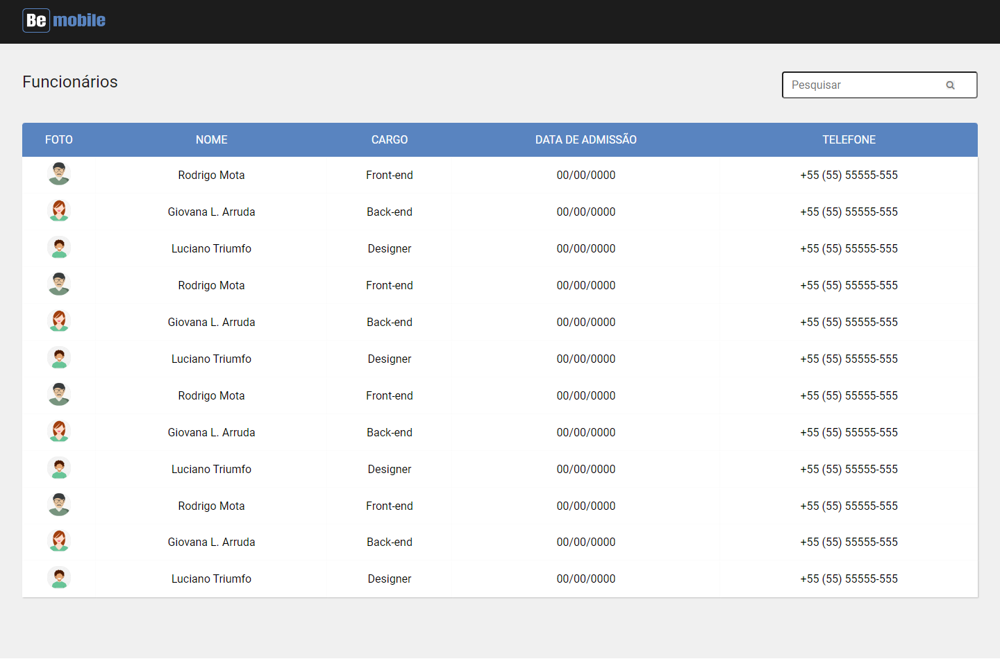

# Desafio Front End TS - Thaís Sandim

<p align="left">


</p>

> Be's Front-end challenge consists of building a table with the information that will come from a simulated API written in json-server. The table must contain the following columns: image, name, position, admission date and telephone, with all data properly formatted and presented as shown in figma. In addition, it should have the possibility to perform a lookup in the table for an input.



## :hammer: Rating criteria

In order of relevance:
- `01`: Programming logic
- `02`: Organization (of code and files)
- `03`: CSS
- `04`: README, which must contain at least the following information: About, Prerequisites, Running the Application


## 📁 Project access

You can access the figma [here](https://www.figma.com/file/y9qJNNAckFRL7LNoyNjpv8/Teste---Be-mobile?node-id=0%3A1).


## :warning: Prerequisites

<a href="https://git-scm.com/">  </a> <a href="https://nodejs.org/en/">  </a> <a href="https://yarnpkg.com/">  </a> 

## :hammer: Running the Application

To start the project, follow the steps below. If you are not familiar with the [json-server](https://github.com/typicode/json-server):
- `01`: Download this project on your machine and create a repository on Github based on it
- `02`: Enter the project and run the commands below
```bash
# Install dependencies
$ yarn
# Execute the json-server
$ yarn json-server --watch db/db.json
```


## ✔️ Tools used

<a href="https://developer.mozilla.org/pt-BR/docs/Web/CSS">  </a>
<a href="https://www.figma.com/files/recent?fuid=1054783839438239746">  </a>
<a href="https://git-scm.com/">  </a> <a href="https://nodejs.org/en/">  </a>
<a href="https://pt-br.reactjs.org/">  </a>  <a href="https://www.typescriptlang.org/">  </a> <a href="https://yarnpkg.com/">  </a> 


## 👩 About me


[](https://linkedin.com/in/thaisdsandim) [](mailto:contatothais.sandim@gmail.com) [](https://api.whatsapp.com/send?phone=5567981551239) 

[Thaís Sandim](https://github.com/thaisdsandim), an Administrator who is learning to be a Dev.

 
